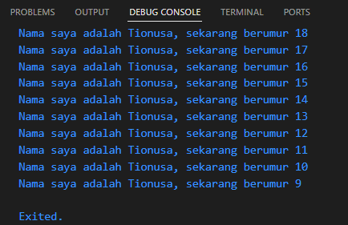
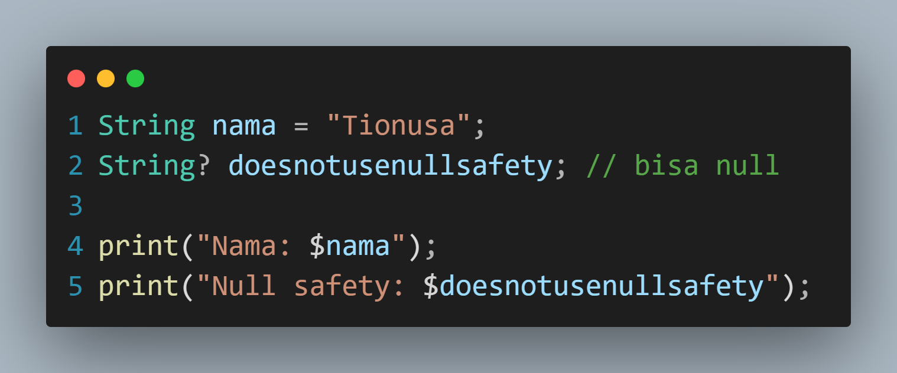
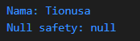
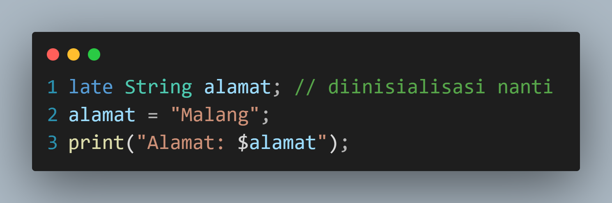
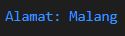

# Tugas Praktikum 
## Soal 1
Modifikasilah kode pada baris 3 di VS Code atau Editor Code favorit Anda berikut ini agar mendapatkan keluaran (output) sesuai yang diminta!

Output yang diminta (Gantilah Fulan dengan nama Anda):

### Jawab:

 
## Soal 2
Mengapa sangat penting untuk memahami bahasa pemrograman Dart sebelum kita menggunakan framework Flutter? Jelaskan!

### Jawab:
Karena Flutter menggunakan Dart sebagai bahasa utama untuk membuat aplikasi, semua komponen atau fitur dalam Flutter ditulis dalam Dart sehingga mempelajari Dart dapat membantu proses belajar Flutter

## Soal 3
Rangkumlah materi dari codelab ini menjadi poin-poin penting yang dapat Anda gunakan untuk membantu proses pengembangan aplikasi mobile menggunakan framework Flutter.

### Jawab:
### **a. Mengapa Dart Penting untuk Flutter**
- Dart adalah bahasa pemrograman utama dalam framework Flutter
- Flutter membutuhkan bahasa yang modern untuk memberikan pengalaman terbaik
- Semua kode aplikasi, plugin, dan dependensi dalam Flutter ditulis menggunakan Dart 

### **b. Apa yang Dipelajari dalam Codelab Ini**
- Memulai dengan Dart: dasar-dasar Dart  
- Evolusi atau Sejarah Dart: perkembangan dan alasan pemilihan Dart  
- Cara Kerja Dart: cara kerja Dart (VM, kompilasi)  
- Pengenalan Struktur Bahasa Dart: sintaks, OOP, operator  
- Praktik dengan Dart: praktik via DartPad/lokal  

### **c. Persiapan Sebelum Belajar**
- PC/Laptop minimal RAM 4GB, Core i3  
- Koneksi internet & Chrome  
- Pengetahuan dasar: Algoritma, Pemrograman Dasar, OOP  

### **d. Fitur Utama Bahasa Dart**
- **Productive tooling**: IDE plugin, analisis kode  
- **Garbage collection**: otomatis mengelola memori  
- **Optional type annotations**: keamanan tipe  
- **Statically typed & type inference**: mengurangi bug  
- **Portability**: mendukung web, mobile (ARM/x86), native compilation  

### **e. Perkembangan Dart (Evolution of Dart)**
- Diluncurkan 2011, stabil 2013, Dart 2.0 (2018)  
- Awalnya untuk web, kini fokus mobile & Flutter  
- Tujuan: performa tinggi, alat modern, OOP kuat, fleksibel  
- Alasan Flutter memilih Dart: modern, lintas platform, fleksibel  

### **f. Cara Kerja Dart**
- **Eksekusi melalui**:  
  - Dart VM (pengembangan & debugging)  
  - JavaScript compilation (untuk web)  
- **Mode Kompilasi**:  
  - JIT (Just-In-Time): cepat untuk hot reload & debugging  
  - AOT (Ahead-Of-Time): optimalisasi performa untuk rilis  
- **Hot reload**: perubahan kode langsung terlihat saat pengembangan  

### **g. Struktur Bahasa Dart**
- Sintaks mirip C/JavaScript  
- Mendukung **OOP**:  
  - Encapsulation  
  - Inheritance  
  - Composition  
  - Abstraction  
  - Polymorphism  
- **Function vs Method**:  
  - Function → di luar class  
  - Method → di dalam class (terkait objek)  

### **h. Operator di Dart**
- Arithmetic: `+`, `-`, `*`, `/`, `~/`, `%`  
- Increment/Decrement: `++`, `--`  
- Equality & Relational: `==`, `!=`, `>`, `<`, `>=`, `<=`  
- Logical: `!`, `||`, `&&`  
- Semua operator adalah **method** pada class, bukan operasi primitif  

### **i. Praktik dengan Dart**
- **DartPad**: alat online untuk menulis & menjalankan kode Dart  
- **Hello World** Example:  
  - Simpan file `.dart`  
  - Jalankan dengan `dart nama_file.dart`  

### **j. Kenapa Belajar Dart Penting untuk Flutter**
- Sintaks Dart: dasar pembuatan widget Flutter  
- OOP Dart: struktur class di Flutter  
- Type safety: mencegah bug  
- Hot reload: keunggulan Flutter didukung JIT Dart  

## Soal 4
Buatlah penjelasan dan contoh eksekusi kode tentang perbedaan Null Safety dan Late variabel!

Kumpulkan jawaban Anda kepada dosen pengampu sesuai kesepakatan di kelas.

### Jawab:
### **A. Null Safety**
Null Safety adalah fitur Dart yang memastikan bahwa **variabel tidak akan bernilai `null`**, kecuali secara eksplisit diizinkan.  
Dengan Null Safety, kita dapat mencegah error seperti **null reference exception**.  
Jika ingin mengizinkan variabel bernilai `null`, gunakan tanda **`?`** setelah tipe data.

#### **Contoh Kode:**

#### **Output:**

### **B. Late Variable**
`late` digunakan untuk **menunda inisialisasi variabel non-nullable** sampai variabel tersebut benar-benar digunakan.  
Ini berguna ketika variabel **tidak dapat diinisialisasi secara langsung**, tetapi kita yakin bahwa variabel tersebut akan memiliki nilai sebelum digunakan.

#### **Contoh Kode:**

#### **Output:**
