# Praktikum 1: Menerapkan Control Flows ("if/else")

## Langkah 1:
Ketik atau salin kode program ke dalam fungsi main().

## Langkah 2:
Silakan coba eksekusi (Run) kode pada langkah 1 tersebut. Apa yang terjadi? Jelaskan!

### Jawab: 
Terdapat kesalahan penulisan kode tapi jika diperbaiki maka akan menampilkan output pada kondisi kedua yaitu test2 serta Test2 again pada ternary operator berhasil ditampilkan:

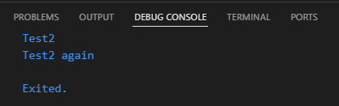

## Langkah 3:
Tambahkan kode program, lalu coba eksekusi (Run) kode Anda.
Apa yang terjadi ? Jika terjadi error, silakan perbaiki namun tetap menggunakan if/else.

### Jawab:
Terjadi error karena perbedaan tipe data, berikut perbaikan kodenya:

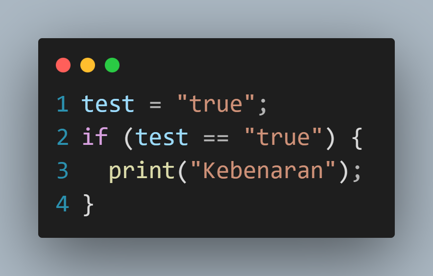
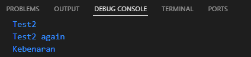

# Praktikum 2: Menerapkan Perulangan "while" dan "do-while"

## Langkah 1:
Ketik atau salin kode program ke dalam fungsi main().

## Langkah 2:
Silakan coba eksekusi (Run) kode pada langkah 1 tersebut. Apa yang terjadi? Jelaskan! Lalu perbaiki jika terjadi error.

### Jawab:
Terjadi error karena variabel belum diinisiasi, jika diperbaiki akan menampilkan output nilai berulang kali dari counter yaitu 0 hingga bernilai 32

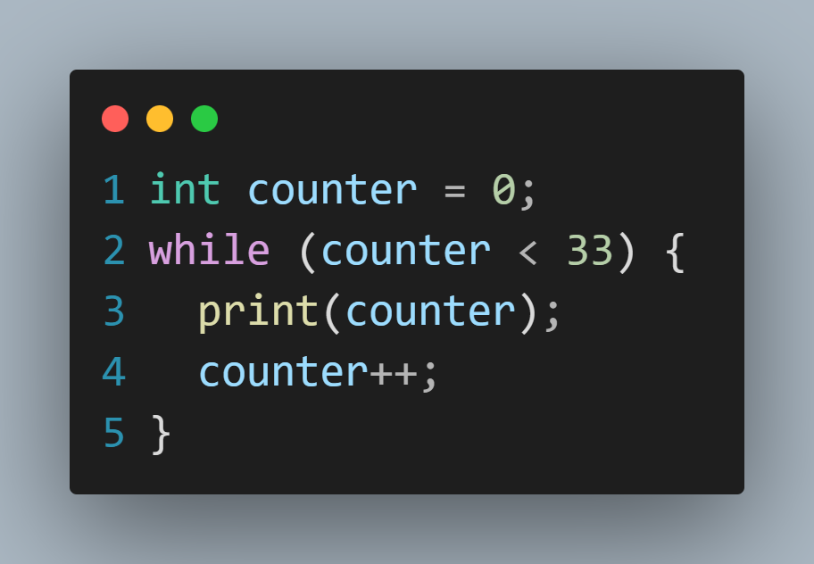
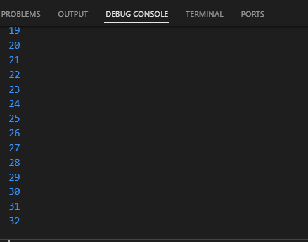

## Langkah 3:
Tambahkan kode program, lalu coba eksekusi (Run) kode Anda.

### Jawab: 
Tidak terjadi error, output menampilkan angka 0 hingga 76

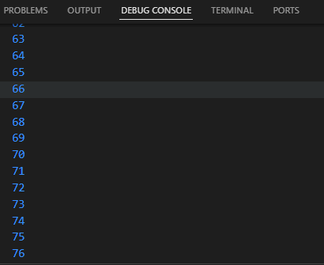

# Praktikum 3: Menerapkan Perulangan "for" dan "break-continue"
## Langkah 1:
Ketik atau salin kode program ke dalam fungsi main().

## Langkah 2:
Silakan coba eksekusi (Run) kode pada langkah 1 tersebut. Apa yang terjadi? Jelaskan! Lalu perbaiki jika terjadi error.

### Jawab:
Terjadi error karena varibel belum diinisialisasi, kesalahan pengetikan variabel Index dan tidak ada pertambahan nilai setiap perulangan, jika diperbaiki maka akan menampilkan perulangan dari angka 10 hingga 26 dengan bertambah 1

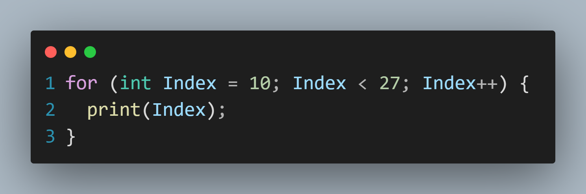
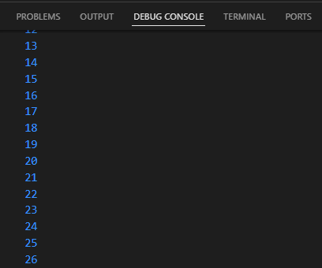

## Langkah 3:
Tambahkan kode program di dalam for-loop, lalu coba eksekusi (Run) kode Anda.

### Jawab:
Jika kode ditempatkan dibawah print(Index) maka Menampilkan output dari perulangan Kode 10 hingga 21 karena terjadi break pada nilai tersebut, namun jika print(Index) diletakkan diakhir, maka output tidak menampilkan apa-apa

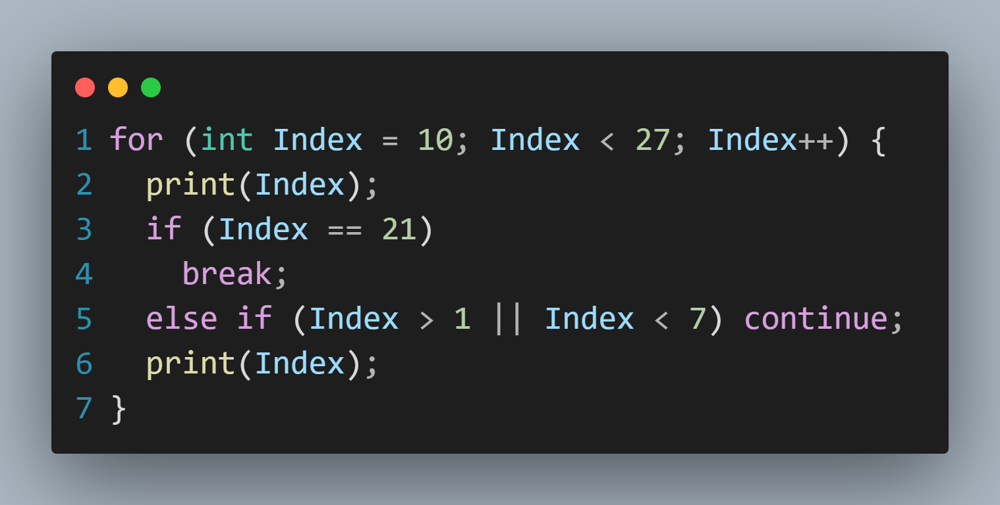
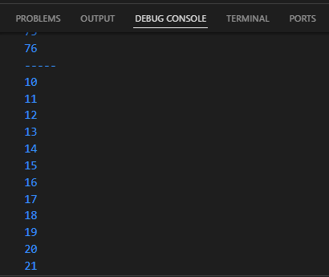

# Tugas Praktikum:
## 2. Buatlah sebuah program yang dapat menampilkan bilangan prima dari angka 0 sampai 201 menggunakan Dart. Ketika bilangan prima ditemukan, maka tampilkan nama lengkap dan NIM Anda.

### Jawab:
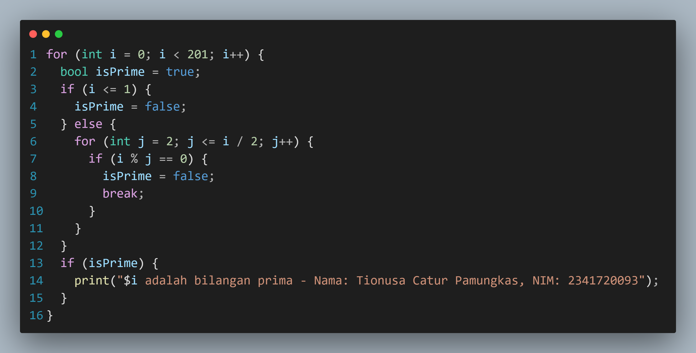
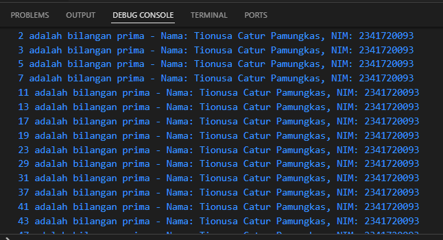