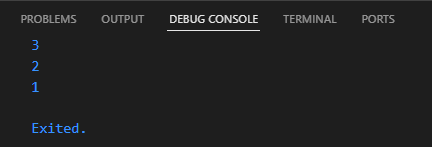

# Praktikum 1: Eksperimen Tipe Data List

## Langkah 1:
Ketik atau salin kode program ke dalam void main().

## Langkah 2:
Silakan coba eksekusi (Run) kode pada langkah 1 tersebut. Apa yang terjadi? Jelaskan!

### Jawab: 
Kode membuat list dengan nilai 1, 2, 3 lalu melakukan debugging agar nilai list memiliki panjang 3 dan pada index 1 nilai harus bernilai 2 lalu menampilkan output:

## Langkah 3:
Ubah kode pada langkah 1 menjadi variabel final yang mempunyai index = 5 dengan default value = null. Isilah nama dan NIM Anda pada elemen index ke-1 dan ke-2. Lalu print dan capture hasilnya.

Apa yang terjadi ? Jika terjadi error, silakan perbaiki.

### Jawab:
final membuat variabel list tidak bisa diganti referensinya (alamat memori), tapi isinya (elemen) tetap bisa diubah.

# Praktikum 2: Eksperimen Tipe Data Set

## Langkah 1:
Ketik atau salin kode program ke dalam fungsi main().

## Langkah 2:
Silakan coba eksekusi (Run) kode pada langkah 1 tersebut. Apa yang terjadi? Jelaskan! Lalu perbaiki jika terjadi error.

### Jawab:
berhasil membuat set tanpa error dan mencetak seluruh nilainya tanpa duplikasi

## Langkah 3:
Tambahkan kode program, lalu coba eksekusi (Run) kode Anda.

Apa yang terjadi ? Jika terjadi error, silakan perbaiki namun tetap menggunakan ketiga variabel tersebut. Tambahkan elemen nama dan NIM Anda pada kedua variabel Set tersebut dengan dua fungsi berbeda yaitu .add() dan .addAll(). Untuk variabel Map dihapus, nanti kita coba di praktikum selanjutnya.

Dokumentasikan code dan hasil di console, lalu buat laporannya.

### Jawab:
variabel names1 dan names2 memiliki Tipe Data Set, sedangkan names3 menjadi Tipe Data Map

Menambahkan nilai dengan nama dan NIM pada kedua variabel Set

# Praktikum 3: Eksperimen Tipe Data Maps

## Langkah 1:
Ketik atau salin kode program ke dalam fungsi main().

## Langkah 2:
Silakan coba eksekusi (Run) kode pada langkah 1 tersebut. Apa yang terjadi? Jelaskan! Lalu perbaiki jika terjadi error.

### Jawab:
Mencetak kedua variabel bertipe data map yang berfungsi seperti key-value pairs

## Langkah 3:
Tambahkan kode program, lalu coba eksekusi (Run) kode Anda.

Apa yang terjadi ? Jika terjadi error, silakan perbaiki.

Tambahkan elemen nama dan NIM Anda pada tiap variabel di atas (gifts, nobleGases, mhs1, dan mhs2). Dokumentasikan hasilnya dan buat laporannya!

### Jawab:
Pada map gifts key fifth tidak berubah karena tipe data berbeda, sedangkan pada map noblegases key 18 tidak berubah karena tipe data berbeda, menambahkan key value baru yaitu nama dan nim pada setiap variabel.

# Praktikum 4: Eksperimen Tipe Data List: Spread dan Control-flow Operators

## Langkah 1:
Ketik atau salin kode program ke dalam fungsi main().

## Langkah 2:
Silakan coba eksekusi (Run) kode pada langkah 1 tersebut. Apa yang terjadi? Jelaskan! Lalu perbaiki jika terjadi error.

### Jawab:
Terdapat error karena tidak ada variabel yang dipanggil, diperbaiki dengan mengubah variabel yang salah menjadi variabel list.

list adalah sebuah list yang berisi nilai [1, 2, 3].
list2 dibuat dengan menggunakan operator penyebaran (...) yang menambahkan semua elemen dari list ke dalam list baru, tetapi sebelumnya menambahkan nilai 0 di depannya. Jadi, list2 seharusnya menjadi [0, 1, 2, 3].
Kode ini kemudian mencetak:

## Langkah 3:
Tambahkan kode program, lalu coba eksekusi (Run) kode Anda.

Apa yang terjadi ? Jika terjadi error, silakan perbaiki.

Tambahkan variabel list berisi NIM Anda menggunakan Spread Operators. Dokumentasikan hasilnya dan buat laporannya!

### Jawab:
Kode:

Output:

Terdapat error karena kurangnya kode var pada list1 untuk mendeklarasikan variabel
list1: Merupakan list dengan elemen [1, 2, null]. Pada list ini terdapat nilai null, yang berarti ada elemen yang tidak didefinisikan atau tidak ada nilai.

list3:
...?list1 menggunakan spread operator yang memiliki tanda tanya (?) untuk menangani kemungkinan null. Operator ...? hanya akan menyebarkan elemen-elemen dari list1 jika list1 tidak null. Jika list1 adalah null, maka ...? tidak akan menyebarkan apapun. Dalam hal ini, list1 berisi [1, 2, null], jadi hasilnya adalah [0, 1, 2, null].

list4: membuat list4 dengan menyebarkan nim (yang berisi 2341720093) menggunakan spread operator. Ini akan menghasilkan list baru yang berisi [2341720093].

## Langkah 4:
Tambahkan kode program, lalu coba eksekusi (Run) kode Anda.

Apa yang terjadi ? Jika terjadi error, silakan perbaiki. Tunjukkan hasilnya jika variabel promoActive ketika true dan false.

### Jawab:
Error karena belum ada variabel promoActive, ketika promoActive true maka akan mencetak seluruh nilai nav, sedangkan jika tidak maka akan mencetak seluruh nilai nav kecuali nilai outlet

## Langkah 5:
Tambahkan kode program, lalu coba eksekusi (Run) kode Anda.

Apa yang terjadi ? Jika terjadi error, silakan perbaiki. Tunjukkan hasilnya jika variabel login mempunyai kondisi lain.

### Jawab:
Terjadi error karena variabel login belum dideklarasikan, setelah diperbaiki maka akan menghasilkan output:

Jika login memiliki kondisi lain maka tidak akan mencetak Inventory

## Langkah 6:
Tambahkan kode program, lalu coba eksekusi (Run) kode Anda.

Apa yang terjadi ? Jika terjadi error, silakan perbaiki. Jelaskan manfaat Collection For dan dokumentasikan hasilnya.

### Jawab:

Kode akan mencetak nilai dari #0 hingga #3.
listOfInts: Variabel ini adalah sebuah list yang berisi integer [1, 2, 3].

listOfStrings:
Di sini digunakan Collection For.
['#0', for (var i in listOfInts) '#$i'] artinya, kita membuat list baru yang dimulai dengan string '#0', kemudian untuk setiap elemen i dalam listOfInts, kita menambahkan string #$i ke dalam list baru tersebut.
    Misalnya, untuk i = 1, maka akan menjadi #1; untuk i = 2, menjadi #2; dan seterusnya.
Hasilnya, listOfStrings akan berisi ['#0', '#1', '#2', '#3'].

assert(listOfStrings[1] == '#1'):
Baris ini adalah sebuah assertion untuk memverifikasi apakah nilai listOfStrings[1] sama dengan '#1'.
Jika kondisi ini benar, program akan terus berjalan tanpa masalah. Jika salah, maka akan terjadi error saat program dijalankan.

print(listOfStrings):
Mencetak hasil list listOfStrings yang dihasilkan dari operasi sebelumnya.

Manfaat:
Collection For adalah fitur Dart yang memungkinkan kita untuk membangun koleksi (seperti list atau set) secara dinamis dengan menggunakan ekspresi kondisional. Fitur ini sangat berguna ketika kita perlu menghasilkan list atau set berdasarkan data lain secara langsung.

# Praktikum 5: Eksperimen Tipe Data Records
## Langkah 1:
Ketik atau salin kode program ke dalam fungsi main().

## Langkah 2:
Silakan coba eksekusi (Run) kode pada langkah 1 tersebut. Apa yang terjadi? Jelaskan! Lalu perbaiki jika terjadi error.

### Jawab:

Record adalah cara yang lebih kuat untuk mendefinisikan koleksi heterogen (elemen dengan tipe berbeda) yang lebih jelas dan mudah diakses.

memiliki dua jenis elemen:
Elemen berbasis urutan (posisi) seperti elemen first dan last.
Elemen berbasis nama seperti a dan b.

## Langkah 3:
Tambahkan kode program di luar scope void main(), lalu coba eksekusi (Run) kode Anda.

Apa yang terjadi ? Jika terjadi error, silakan perbaiki. Gunakan fungsi tukar() di dalam main() sehingga tampak jelas proses pertukaran value field di dalam Records.

### Jawab:
fungsi tersebut menerima sebuah parameter bertipe Record yang berisi dua nilai bertipe int (misalnya, (int, int)).
Di dalam fungsi, mendekonstruksi record tersebut menjadi dua variabel, yaitu a dan b.
Kemudian, mengembalikan Record baru dengan menukar nilai a dan b (yaitu (b, a)).

## Langkah 4:
Tambahkan kode program di dalam scope void main(), lalu coba eksekusi (Run) kode Anda.

Apa yang terjadi ? Jika terjadi error, silakan perbaiki. Inisialisasi field nama dan NIM Anda pada variabel record mahasiswa di atas. Dokumentasikan hasilnya dan buat laporannya!

### Jawab:
mendefinisikan tipe dari Record yang akan berisi dua nilai String dan int untuk nama dan nim mahasiswa,
lalu menginisialisasi variabel mahasiswa dengan nama dan nim

## Langkah 5:
Tambahkan kode program di dalam scope void main(), lalu coba eksekusi (Run) kode Anda.

Apa yang terjadi ? Jika terjadi error, silakan perbaiki. Gantilah salah satu isi record dengan nama dan NIM Anda, lalu dokumentasikan hasilnya dan buat laporannya!

### Jawab:
mahasiswa2.$1 mengakses elemen pertama dalam Record, yaitu 'first'.
mahasiswa2.a mengakses field a yang memiliki nilai 2.
mahasiswa2.b mengakses field b yang memiliki nilai true.
mahasiswa2.$2 mengakses elemen terakhir dalam Record, yaitu 'last'.

Mengisi record dengan nama dan nim

# Tugas Praktikum
1. Silakan selesaikan Praktikum 1 sampai 5, lalu dokumentasikan berupa screenshot hasil pekerjaan Anda beserta penjelasannya!
2. Jelaskan yang dimaksud Functions dalam bahasa Dart!
3. Jelaskan jenis-jenis parameter di Functions beserta contoh sintaksnya!
4. Jelaskan maksud Functions sebagai first-class objects beserta contoh sintaknya!
5. Apa itu Anonymous Functions? Jelaskan dan berikan contohnya!
6. Jelaskan perbedaan Lexical scope dan Lexical closures! Berikan contohnya!
7. Jelaskan dengan contoh cara membuat return multiple value di Functions!

Kumpulkan berupa link commit repo GitHub kepada dosen pengampu sesuai kesepakatan di kelas!

## Jawab:
2. Functions adalah blok kode yang dapat menerima input, melakukan pemrosesan, dan mengembalikan output. Fungsi digunakan untuk mengorganisasi dan mendaur ulang kode agar lebih mudah dipelihara dan dibaca.
3. Dart mendukung berbagai jenis parameter pada fungsi, antara lain: 
Positional Parameters (Parameter Posisi):
int sum(int a, int b) {
  return a + b;
}
print(sum(5, 10)); // 15

Named Parameters (Parameter Bernama):
void printDetails({String name, int age}) {
  print('Name: $name, Age: $age');
}
printDetails(name: 'Alice', age: 30); // Name: Alice, Age: 30

Optional Parameters (Parameter Opsional)
void greet(String name, [String greeting = 'Hello']) {
  print('$greeting, $name!');
}
greet('John');         // Hello, John!
greet('John', 'Hi');   // Hi, John!

Default Parameter Value (Nilai Default Parameter)
void sayHi(String name, [String greeting = 'Hello']) {
  print('$greeting, $name!');
}
sayHi('Alice'); // Output: Hello, Alice!

4. functions adalah first-class objects, yang berarti fungsi dapat diperlakukan seperti objek lainnya. Artinya:
Fungsi dapat disimpan dalam variabel.
Fungsi dapat diteruskan sebagai parameter ke fungsi lain.
Fungsi dapat dikembalikan sebagai hasil dari fungsi lain.

Contoh sintaksnya:
// Fungsi sebagai variabel
var add = (int a, int b) => a + b;
print(add(5, 10)); // Output: 15

// Fungsi sebagai parameter
void executeFunction(Function f) {
  print(f(2, 3));  // Output: 5
}

executeFunction(add); // Menyisipkan fungsi 'add' ke dalam executeFunction

5. Anonymous functions adalah fungsi yang tidak memiliki nama. Mereka sering digunakan untuk operasi sekali pakai atau sebagai parameter dalam fungsi lain.

var numbers = [1, 2, 3, 4, 5];

// Menggunakan fungsi anonim untuk menambahkan angka-angka dalam list
var sum = numbers.fold(0, (prev, current) => prev + current);
print(sum); // Output: 15

6. Lexical scope merujuk pada konteks tempat variabel dan fungsi dideklarasikan. Artinya, dalam sebuah fungsi atau blok kode, hanya dapat mengakses variabel yang dideklarasikan di dalam blok tersebut atau dalam ruang lingkup lebih besar yang mencakup blok tersebut.
Contoh:
void outerFunction() {
  var outerVar = 'I am from outer scope';
  
  void innerFunction() {
    print(outerVar);  // Bisa mengakses outerVar karena berada dalam scope lexical yang sama
  }
  
  innerFunction();
}

outerFunction(); // Output: I am from outer scope

Lexical closures adalah konsep dimana fungsi di dalam suatu scope (seperti fungsi dalam fungsi) dapat mengingat variabel dari scope luar meskipun fungsi tersebut dipanggil di luar scope tersebut.
Function createMultiplier(int multiplier) {
  return (int value) {
    return value * multiplier;  // Memanfaatkan variabel multiplier dari lexical scope luar
  };
}

var multiplyBy2 = createMultiplier(2);
print(multiplyBy2(5)); // Output: 10

7. Dart tidak mendukung return multiple values secara langsung tetapi bisa menggunakan Record, List, Map
Contoh Record:
(int, int) returnMultipleValues() {
  return (5, 10); // Mengembalikan dua nilai
}

void main() {
  var result = returnMultipleValues();
  print(result.$1); // Output: 5
  print(result.$2); // Output: 10
}

Contoh List:
List<int> returnMultipleValues() {
  return [5, 10]; // Mengembalikan beberapa nilai dalam list
}

void main() {
  var result = returnMultipleValues();
  print(result[0]); // Output: 5
  print(result[1]); // Output: 10
}

Contoh Map:
Map<String, int> returnMultipleValues() {
  return {'first': 5, 'second': 10}; // Mengembalikan nilai dalam map
}

void main() {
  var result = returnMultipleValues();
  print(result['first']);  // Output: 5
  print(result['second']); // Output: 10
}
