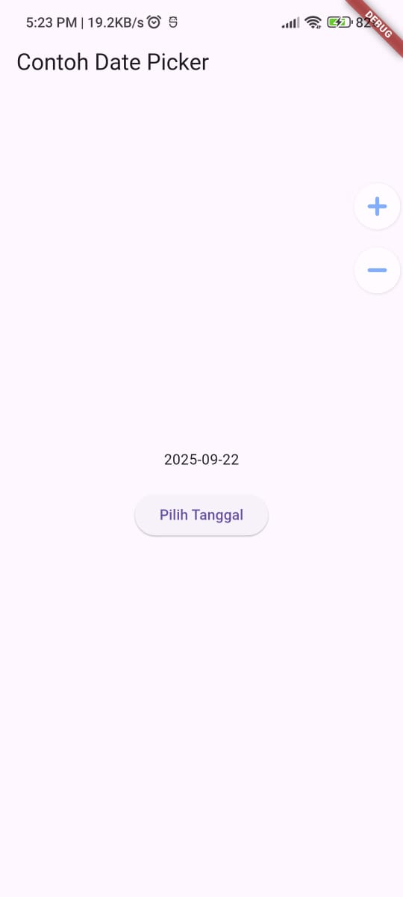

# Praktikum 1: Membuat Project Flutter Baru

# Praktikum 2: Menghubungkan Perangkat Android atau Emulator

# Praktikum 3: Membuat Repository GitHub dan Laporan Praktikum

# Praktikum 4: Menerapkan Widget Dasar
## Text Widget

## Image Widget

# Praktikum 5: Menerapkan Widget Material Design dan iOS Cupertino
## Langkah 1: Cupertino Button dan Loading Bar

## Langkah 2: Floating Action Button (FAB)

## Langkah 3: Scaffold Widget

## Langkah 4: Dialog Widget

## Langkah 5: Input dan Selection Widget

## Langkah 6: Date and Time Pickers

