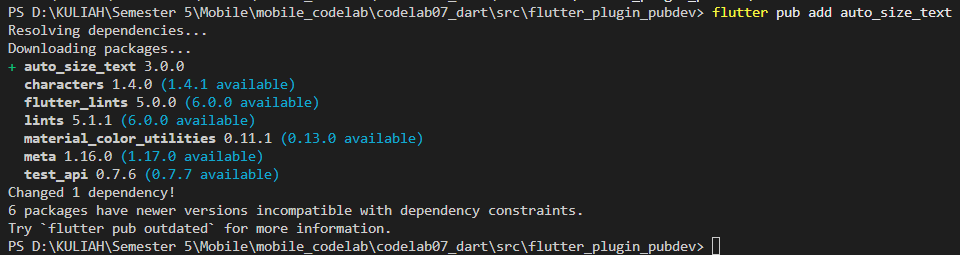
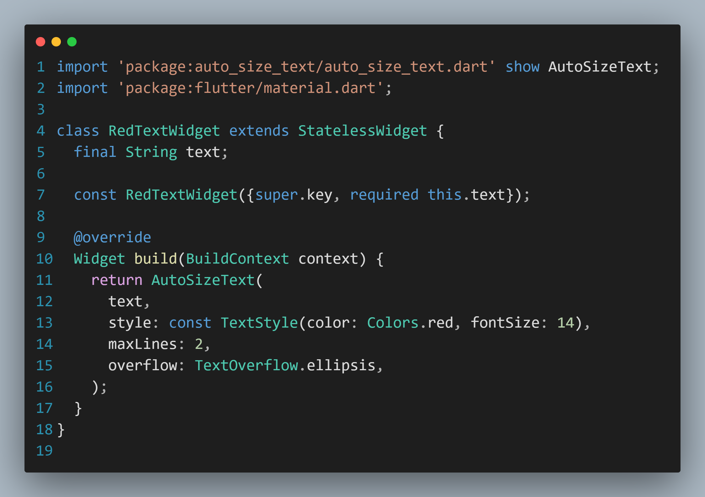
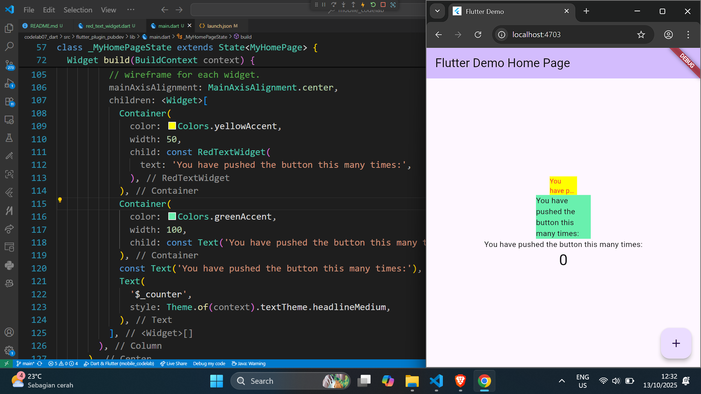

# Praktikum Menerapkan Plugin di Project Flutter

## Langkah 1: Buat Project Baru
Buatlah sebuah project flutter baru dengan nama flutter_plugin_pubdev. Lalu jadikan repository di GitHub Anda dengan nama flutter_plugin_pubdev.

## Langkah 2: Menambahkan Plugin
Tambahkan plugin auto_size_text menggunakan perintah berikut di terminal
```Terminal
flutter pub add auto_size_text
```
Jika berhasil, maka akan tampil nama plugin beserta versinya di file pubspec.yaml pada bagian dependencies.


## Langkah 3: Buat file red_text_widget.dart
Buat file baru bernama red_text_widget.dart di dalam folder lib lalu isi kode seperti berikut.
```Dart
import 'package:flutter/material.dart';

class RedTextWidget extends StatelessWidget {
  const RedTextWidget({Key? key}) : super(key: key);

  @override
  Widget build(BuildContext context) {
    return Container();
  }
}
```

## Langkah 4: Tambah Widget AutoSizeText
Masih di file red_text_widget.dart, untuk menggunakan plugin auto_size_text, ubahlah kode return Container() menjadi seperti berikut.
```Dart
return AutoSizeText(
      text,
      style: const TextStyle(color: Colors.red, fontSize: 14),
      maxLines: 2,
      overflow: TextOverflow.ellipsis,
);
```
Setelah Anda menambahkan kode di atas, Anda akan mendapatkan info error. Mengapa demikian? Jelaskan dalam laporan praktikum Anda!
Jawab: Error terjadi karena variabel text belum diinisiasikan


## Langkah 5: Buat Variabel text dan parameter di constructor
Tambahkan variabel text dan parameter di constructor seperti berikut.
```Dart
final String text;

const RedTextWidget({Key? key, required this.text}) : super(key: key);
```

## Langkah 6: Tambahkan widget di main.dart
Buka file main.dart lalu tambahkan di dalam children: pada class _MyHomePageState
```Dart
Container(
   color: Colors.yellowAccent,
   width: 50,
   child: const RedTextWidget(
             text: 'You have pushed the button this many times:',
          ),
),
Container(
    color: Colors.greenAccent,
    width: 100,
    child: const Text(
           'You have pushed the button this many times:',
          ),
),
```
Run aplikasi tersebut dengan tekan F5, maka hasilnya akan seperti berikut.


# Tugas Praktikum
1. Selesaikan Praktikum tersebut, lalu dokumentasikan dan push ke repository Anda berupa screenshot hasil pekerjaan beserta penjelasannya di file README.md!
2. Jelaskan maksud dari langkah 2 pada praktikum tersebut!
3. Jelaskan maksud dari langkah 5 pada praktikum tersebut!
4. Pada langkah 6 terdapat dua widget yang ditambahkan, jelaskan fungsi dan perbedaannya!
5. Jelaskan maksud dari tiap parameter yang ada di dalam plugin auto_size_text berdasarkan tautan pada dokumentasi ini !
6. Kumpulkan laporan praktikum Anda berupa link repository GitHub kepada dosen!

## Jawab:
2. digunakan untuk menambahkan dependency (ketergantungan) auto_size_text pada proyek Flutter melalui pub.dev, yang merupakan repositori paket untuk Flutter dan Dart.
3. untuk menambahkan variabel text dan parameter di constructor pada kelas RedTextWidget
4.  Widget pertama: Container dengan RedTextWidget di dalamnya.
    Widget kedua: Container dengan Text biasa di dalamnya.
5. Parameter dari Plugin AutoSizeText
- maxLines

   Parameter maxLines berfungsi seperti yang Anda kenal pada widget Text. Jika parameter maxLines tidak ditentukan, AutoSizeText hanya menyesuaikan teks sesuai dengan lebar dan tinggi yang tersedia.
    ```Dart
    AutoSizeText(
    'A really long String',
    style: TextStyle(fontSize: 30),
    maxLines: 2,
    )
    ```

- minFontSize & maxFontSize

   AutoSizeText dimulai dengan TextStyle.fontSize. Ia mengukur teks hasil dan menyesuaikan ukurannya agar sesuai dengan batasnya. Anda dapat mengatur rentang ukuran font yang diizinkan.

   Dengan minFontSize, Anda dapat menentukan ukuran font terkecil yang mungkin. Jika teks masih tidak muat, maka akan ditangani sesuai dengan overflow. Nilai default minFontSize adalah 12.

   maxFontSize menentukan ukuran font terbesar yang mungkin. Ini berguna jika TextStyle mewarisi ukuran font dan Anda ingin membatasinya.
    ```Dart
    AutoSizeText(
    'A really long String',
    style: TextStyle(fontSize: 30),
    minFontSize: 18,
    maxLines: 4,
    overflow: TextOverflow.ellipsis,
    )
    ```

- group

   Anda dapat mensinkronkan ukuran font dari beberapa AutoSizeText. Mereka akan menyesuaikan batasannya, dan semua AutoSizeText dalam grup yang sama akan memiliki ukuran yang sama. Artinya, mereka menyesuaikan ukuran fontnya dengan anggota grup yang memiliki ukuran font efektif terkecil.

   **Catatan**: Jika AutoSizeText tidak dapat menyesuaikan karena batasan seperti minFontSize, ia tidak akan memiliki ukuran yang sama dengan anggota grup lainnya.

   Sebuah instance dari AutoSizeGroup mewakili satu grup. Berikan instance ini ke semua AutoSizeText yang ingin Anda tambahkan ke grup tersebut. Anda tidak perlu khawatir tentang membuang grup jika sudah tidak diperlukan lagi.

   **Penting**: Jangan berikan instance baru dari AutoSizeGroup setiap build. Dengan kata lain, simpan instance AutoSizeGroup dalam StatefulWidget.

    ```Dart
    var myGroup = AutoSizeGroup();

    AutoSizeText(
    'Text 1',
    group: myGroup,
    );

    AutoSizeText(
    'Text 2',
    group: myGroup,
    );
    ```

- stepGranularity

   AutoSizeText akan mencoba setiap ukuran font, mulai dari TextStyle.fontSize hingga teks muat dalam batasnya.

   stepGranularity menentukan seberapa banyak ukuran font berkurang setiap langkah. Biasanya, nilai ini tidak boleh di bawah 1 untuk kinerja terbaik.

    ```Dart
    AutoSizeText(
    'A really long String',
    style: TextStyle(fontSize: 40),
    minFontSize: 10,
    stepGranularity: 10,
    maxLines: 4,
    overflow: TextOverflow.ellipsis,
    )
    ```

- presetFontSizes

   Jika Anda ingin membatasi ukuran font tertentu, Anda dapat mengaturnya dengan presetFontSizes. Jika presetFontSizes diatur, minFontSize, maxFontSize, dan stepGranularity akan diabaikan.

    ```Dart
    AutoSizeText(
    'A really long String',
    presetFontSizes: [40, 20, 14],
    maxLines: 4,
    )
    ```

- overflowReplacement

   Jika teks meluap dan tidak muat dalam batasnya, widget ini akan ditampilkan sebagai gantinya. Hal ini dapat berguna untuk mencegah teks menjadi terlalu kecil untuk dibaca.
    ```Dart
    AutoSizeText(
    'A String tool long to display without extreme scaling or overflow.',
    maxLines: 1,
    overflowReplacement: Text('Sorry String too long'),
    )
    ```

- Rich Text

   Anda juga dapat menggunakan Rich Text (seperti gaya teks yang berbeda atau tautan) dengan AutoSizeText. Cukup gunakan konstruktor AutoSizeText.rich() (yang berfungsi persis seperti konstruktor Text.rich()).

   Hal yang perlu Anda perhatikan adalah cara perhitungan ukuran font: Nilai fontSize dalam parameter style dari AutoSizeText (atau nilai fontSize yang diwarisi jika tidak ada yang ditetapkan) digunakan sebagai referensi.

    ```Dart
    AutoSizeText.rich(
    TextSpan(text: 'A really long String'),
    style: TextStyle(fontSize: 20),
    minFontSize: 5,
    )
    ```

   The text will be at least 1/4 of its original size (5 / 20 = 1/4).
   But it does not mean that all TextSpans have at least font size 5.

| Parameter	 |  Description  |
|:-----|:--------:|
| key* | Controls how one widget replaces another widget in the tree. |
| textKey   |  Sets the key for the resulting Text widget |
| style* | If non-null, the style to use for this text |
| minFontSize | The **minimum** text size constraint to be used when auto-sizing text. *Is being ignored if presetFontSizes is set.* |
| maxFontSize | The **maximum** text size constraint to be used when auto-sizing text. *Is being ignored if presetFontSizes is set.* |
| stepGranularity | The step size in which the font size is being adapted to constraints. |
| presetFontSizes | Predefines all the possible font sizes. **Important:** presetFontSizes have to be in descending order. |
| group | Synchronizes the size of multiple AutoSizeTexts |
| textAlign* | How the text should be aligned horizontally. |
| textDirection* | The directionality of the text. This decides how textAlign values like TextAlign.start and TextAlign.end are interpreted. |
| locale* | Used to select a font when the same Unicode character can be rendered differently, depending on the locale. |
| softWrap* | Whether the text should break at soft line breaks. |
| wrapWords | Whether words which don't fit in one line should be wrapped. Defaults to true to behave like Text. |
| overflow* | How visual overflow should be handled. |
| overflowReplacement | If the text is overflowing and does not fit its bounds, this widget is displayed instead. |
| textScaleFactor* | The number of font pixels for each logical pixel. Also affects minFontSize, maxFontSize and presetFontSizes. |
| maxLines | An optional maximum number of lines for the text to span. |
| semanticsLabel* | An alternative semantics label for this text. |